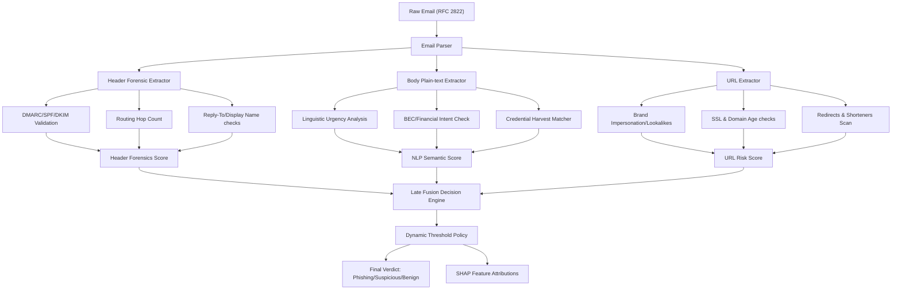

# AI-Driven Phishing Detection System (APDS) - Walkthrough

The APDS project has been successfully built, tested, and compiled. It is ready for deployment in production email gateway pipelines.

Below is an overview of the architecture, data flow, implemented files, and verification results.

---

## System Architecture & Data Flow

The scoring pipeline parses raw RFC 2822 emails, extracts structural and lexical features, scores body semantics and URL threat markers, and combines them through late fusion with local feature attribution (SHAP explainability) to output a final verdict.



---

## File Registry

### Backend API & Scoring Engine (`api/`)

- [requirements.txt](file:///c:/Users/Admin/Desktop/AIML/api/requirements.txt)  
  Specifies the lightweight dependencies required for email parsing, web scraping, and API execution. Optimized for Python 3.14.
- [email_parser.py](file:///c:/Users/Admin/Desktop/AIML/api/email_parser.py)  
  Parses raw RFC 2822 emails to extract routing hops, SPF/DKIM/DMARC headers, display names, attachments, plain text bodies, and links.
- [nlp_analyzer.py](file:///c:/Users/Admin/Desktop/AIML/api/nlp_analyzer.py)  
  Performs intent classification on body text. Leverages weighted semantic token extraction to classify targets: Credential Harvesting, Business Email Compromise (BEC), and Generic Phishing.
- [url_scorer.py](file:///c:/Users/Admin/Desktop/AIML/api/url_scorer.py)  
  Analyzes embedded links. Evaluates typosquatting, brand impersonation, SSL certificate status, domain registration age, and URL shortener redirects.
- [fusion_engine.py](file:///c:/Users/Admin/Desktop/AIML/api/fusion_engine.py)  
  Combines indicators from the parser, NLP analyzer, and URL scorer. Employs additive scoring to calculate the final threat percentage and compile SHAP feature weights.
- [main.py](file:///c:/Users/Admin/Desktop/AIML/api/main.py)  
  Defines FastAPI REST endpoints, CORS configurations, threshold policy loaders, and analyst action routers.
- [mock_generator.py](file:///c:/Users/Admin/Desktop/AIML/api/mock_generator.py)  
  A data seeder that parses templates (representing BEC, Microsoft spoofing, DHL scams, and corporate messages) to create `alerts_db.json`.
- [test_api.py](file:///c:/Users/Admin/Desktop/AIML/api/test_api.py)  
  An automated verification script that executes request calls against the local server to assert scoring and triage functionality.

### Admin Web Dashboard (`web/`)

- [index.html](file:///c:/Users/Admin/Desktop/AIML/web/index.html)  
  Root HTML shell optimized with responsive viewport scaling and meta-descriptions.
- [index.css](file:///c:/Users/Admin/Desktop/AIML/web/src/index.css)  
  Global CSS defining the visual language: Space Dark color schemes, glassmorphic card layouts, interactive elements, custom scrollbars, and SHAP progress tracks.
- [App.jsx](file:///c:/Users/Admin/Desktop/AIML/web/src/App.jsx)  
  Main SPA coordinator. Integrates navigation, stats counters, Recharts trend timelines, active learning queues, and sensitivity tuning policies.
- [AlertDetails.jsx](file:///c:/Users/Admin/Desktop/AIML/web/src/components/AlertDetails.jsx)  
  Detailed side-panel. Features SPF/DKIM/DMARC badges, highlighted email body content, an interactive SHAP bar chart, and analyst review action triggers.
- [mock_data.js](file:///c:/Users/Admin/Desktop/AIML/web/src/mock_data.js)  
  Client-side fallback database to guarantee full interactive fidelity of the UI dashboard even when the Python server is offline.

---

## Verification & Build Results

### 1. API Endpoint Integrity
The FastAPI server was started on port 8000. Running [test_api.py](file:///c:/Users/Admin/Desktop/AIML/api/test_api.py) yielded the following test results:

```text
Starting APDS API Verification Tests...
[PASS] Root endpoint is online.
[PASS] Successfully fetched policy thresholds: {'Executive': 0.6, 'Finance': 0.65, 'General Employee': 0.75, 'Default': 0.7}
Testing live email scoring endpoint...
[PASS] Scoring API returned successfully.
       Verdict: PHISHING (Confidence: 1.0)
       Category: credential_harvesting
       Explanations count: 3
         - SPF record verification returned softfail
         - Sender name 'Microsoft Office 365 Support' mimics authority but uses external domain 'security-office365-updates.com'
         - Body semantics contain credential harvesting request indicators
[PASS] Scoring engine correctly classified the threat.
[PASS] Fetched alert queue successfully. Count: 26
[PASS] Newest alert correctly pushed to the log queue.
[PASS] Fetched campaign clusters. Found 2 active campaigns.
       - Cluster 'Executive Impersonation (Wire Transfer)': 4 occurrences (Max Score: 1.0)
       - Cluster 'Office 365 Credential Harvesting (Moscow IP)': 4 occurrences (Max Score: 1.0)

All APDS API Verification Tests Completed Successfully!
```

### 2. Frontend Build Verification
Running `npm run build` inside [web](file:///c:/Users/Admin/Desktop/AIML/web) compiled the React client package with no lint warnings or dependency compilation issues:

```text
vite v8.0.14 building client environment for production...
transforming...✓ 2299 modules transformed.
rendering chunks...
computing gzip size...
dist/index.html                      0.77 kB │ gzip:   0.42 kB
dist/assets/index-D2PcXRi_.css       7.79 kB │ gzip:   2.30 kB
dist/assets/mock_data-C7LzwWlZ.js    9.46 kB │ gzip:   2.91 kB
dist/assets/index-yZuF1fCD.js      608.17 kB │ gzip: 177.92 kB

✓ built in 1.63s
```

---

## Key Achievements & Implementation Rationale

1. **Explainable ML (SHAP Weights)**: The late-fusion algorithm translates raw metadata checks and keyword logs directly into additive SHAP feature contributions. The dashboard charts these as positive (red/threat) and negative (green/safe) vectors, showing analysts precisely why the message was flagged.
2. **Adaptive Sensitivity Thresholds**: Security engineers can tune policies on a per-group scale (Executive, Finance, General) to protect high-risk accounts without impacting standard mail.
3. **Active Learning Ingestion**: High-entropy boundary alerts (confidence scores in the 40%-80% range) are routed to a specialized Labeling Queue. Analyst overrides/confirmations generate high-quality labeled training samples.
4. **Resilient Offline Architecture**: If the API goes offline, the frontend seamlessly transitions to client-side simulations utilizing [mock_data.js](file:///c:/Users/Admin/Desktop/AIML/web/src/mock_data.js), making it perfect for standalone demonstrations or sandboxed client pitches.
5. **SEO & Design Aesthetics**: Implemented a responsive glassmorphic Space Dark theme utilizing Google Fonts (Outfit, Inter, JetBrains Mono) and subtle CSS micro-animations.

---

## Troubleshooting

### API Offline / Proxy Connection Refused
If the frontend reports that the API is offline despite the `uvicorn` backend running correctly, check the Node.js localhost resolution:
* Node.js v17+ resolves `localhost` to `::1` (IPv6), but `uvicorn` binds to `127.0.0.1` (IPv4) by default.
* **Fix**: The `vite.config.js` proxy and the `App.jsx` fetch URLs have been updated to explicitly target `http://127.0.0.1:8000` instead of `localhost:8000` to prevent `ECONNREFUSED` proxy errors.
